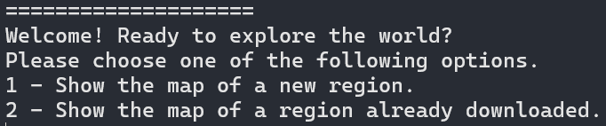

# Rutes-i-Monuments
Made by: Martí Gil, Haokang Chen

## Description
These programs are the [second task for Algoritmics and Programming II](https://github.com/jordi-petit/ap2-rutes-i-monuments-2024).

The project consists in obtaining information about routes in a certain region that hikers upload to the web to then create a graph of the common paths taken by all of them. Furthermore, the programs will look for nearby monuments and find the shortest path to get there from a certain location. All of these graphs will be saved as a PNG and a KML file that the user can upload to [Google Earth](https://www.google.es/intl/es/earth/index.html).

The routes are downloaded from [OpenStreetMap](https://www.openstreetmap.org/#map=12/41.3823/2.1279) and the monuments are imported from [Catalunya Medieval](https://www.catalunyamedieval.es/). 

All the graph processing is done with [NetworkX](https://networkx.org/documentation/stable/tutorial.html). The exportations are done with [StaticMap](https://github.com/komoot/staticmap/blob/master/README.md) for the PNG file and [Simplekml](https://simplekml.readthedocs.io/en/latest/) for the KML file.

Mode details about the implementation will be given in [Development](#development).

## Requirements

This project uses the following python libraries:
- [requests](https://pypi.org/project/requests/): to request importations from the web.
- [gpxpy](https://pypi.org/project/gpxpy/): to import the gpx data from OpenStreetMap.
- [csv](https://docs.python.org/3/library/csv.html): to read and write .csv files.
- [staticmap](https://developers.google.com/maps/documentation/maps-static/overview?hl=es-419): to export the graph to a PNG file.
- [networkx](https://networkx.org/documentation/stable/reference/index.html): to create and edit graphs.
- [KMeans](https://scikit-learn.org/stable/modules/generated/sklearn.cluster.KMeans.html): to create clusters on the graph.
- [haversine](https://pypi.org/project/haversine/): To calculate distances on Earth's surface.
- [simplekml](https://simplekml.readthedocs.io/en/latest/): do create a kml file.

To install these libraries, execute:

`python3 -r pip install requirements.txt`

Please have in mind that Some of these libraries do not have type specifications, so Mypy may rise some warning when type-checking.

## Usage

To start the program, enter the command `python3 main.py` in your terminal. The following text should appear:

- The first option is to download the data of a new region to then show the routes.
- The second option is to show the routes of an already-downloaded region.
- The third option is to re-download the monuments of Catalonia (only if the user accidentally deletes the file or wants to update it)

If the first option is chosen, a set of real numbers have to be written. They correspond to the latitude and longitude of the south, west, north and east boundaries of the region that will be worked on. For example, for Girona, these numbers are `41.940344, 2.778792, 42.018007, 2.849885`.

Afterwards, the user will be asked to write a name for the region. The `.csv`, `.png` and `.kml` files that are created will have that name.

If the second option is chosen, the user will only have to write the name of a previously downloaded region. If this region doesn't exist, the program will terminate.

After writing a name for this region, an image will appear that shows the most common routes that hikers take. This image will be automatically saved in the folder along with a KML file. This KML file can be uploaded to [Google Earth](https://www.google.es/intl/es/earth/index.html) following [these steps](https://support.google.com/mymaps/answer/3024836?hl=en&co=GENIE.Platform%3DDesktop).

**AQUI FALTA UNA IMATGE D'EXEMPLE DE PNG I KML**

Finally the user will be asked for his location (with the same format as before: latitude and longitude separated by a space). Then the user will be shown the location of the nearby monuments along with the shortest path to get there. As before, an image will appear which contains the location of some nearby monuments and a route to get to them.

**AQUI FALTA UNA IMATGE DELS MONUMENTS**

Keep in mind that access to internet is required for this program to work. This is because some webs (such as [OpenStreetMap](https://www.openstreetmap.org/#map=12/41.3823/2.1279)) are accessed during the execution.

## Development

### Storing data

The data imported form [OpenStreetMap](https://www.openstreetmap.org/#map=12/41.3823/2.1279) is stored in a `.csv` file, and all it's treatments will be done with the module [segments.py](segments.py).

The first two rows of the csv correspond to the boundaries of the box. The first column is the latitude, the second one is the longitude and the third column is a number that identifies every segment (route that a hiker took).

### Graph making

The graph is a simplification of all the data downloaded from [OpenStreetMap](https://www.openstreetmap.org/#map=12/41.3823/2.1279). The nodes are clusters that are found using K-means on the data and the edges are added if there is a segment that connects two clusters.

### Exporting to PNG

The PNG file of the routes will be rendered using [staticmap](https://developers.google.com/maps/documentation/maps-static/overview?hl=es-419).The PNG will be shown on screen and saved on the same folder with the code once it is rendered. 

### Exporting to KML
One must imagine Sisyphus happy.

### Downloading monuments
One must imagine Sisyphus happy.

### Showing monument paths
One must imagine Sisyphus happy.
