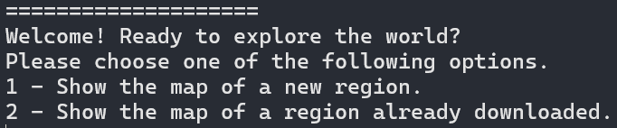

# Rutes-i-Monuments
Made by: Martí Gil, Haokang Chen

## Description
These programs are the [second task for Algoritmics and Programming II](https://github.com/jordi-petit/ap2-rutes-i-monuments-2024).

The project consists in obtaining information about routes in a certain region that hikers upload to the web to then create a graph of the common paths taken by all of them. Furthermore, the programs will look for nearby monuments and find the shortest path to get there from a certain location. All of these graphs will be saved as a PNG and a KML file that the user can upload to [Google Earth](https://www.google.es/intl/es/earth/index.html).

The routes are downloaded from [OpenStreetMap](https://www.openstreetmap.org/#map=12/41.3823/2.1279) and the monuments are imported from [Catalunya Medieval](https://www.catalunyamedieval.es/). 

All the graph processing is done with [NetworkX](https://networkx.org/documentation/stable/tutorial.html). The exportations are done with [StaticMap](https://github.com/komoot/staticmap/blob/master/README.md) for the PNG file and [Simplekml](https://simplekml.readthedocs.io/en/latest/) for the KML file.

More details about the implementation will be given in [Development](#development).

## Requirements

This project uses the following python libraries:
- [requests](https://pypi.org/project/requests/): to request importations from the web.
- [gpxpy](https://pypi.org/project/gpxpy/): to import the gpx data from OpenStreetMap.
- [csv](https://docs.python.org/3/library/csv.html): to read and write .csv files.
- [staticmap](https://developers.google.com/maps/documentation/maps-static/overview?hl=es-419): to export the graph to a PNG file.
- [networkx](https://networkx.org/documentation/stable/reference/index.html): to create and edit graphs.
- [scikit-learn](https://scikit-learn.org/stable/modules/generated/sklearn.cluster.KMeans.html): to create clusters on the graph.
- [haversine](https://pypi.org/project/haversine/): To calculate distances on Earth's surface.
- [simplekml](https://simplekml.readthedocs.io/en/latest/): do create a kml file.

To install these libraries, execute:

`pip3 install -r requirements.txt`

Please keep in mind that some of these libraries do not have type specifications, so Mypy may rise some warnings when type-checking.

## Usage

To start the program, enter the command `python3 main.py` in your terminal. The following text should appear:

- The first option is to download the data of a new region to then show the routes.
- The second option is to show the routes of an already-downloaded region.

If the first option is chosen, a set of real numbers have to be written. They correspond to the latitude and longitude of the south, west, north and east boundaries of the region that will be worked on. For example, for Girona, these numbers are `41.9000 2.6992 42.0575 2.9436`.

Afterwards, the user will be asked to write a name for the region. The `.csv`, `.png` and `.kml` files that are created will have that name.

If the second option is chosen, the user will only have to write the name of a previously downloaded region. If this region doesn't exist, the program will terminate.

After writing a name for this region, an image will be saved (filename_points.png) that shows all the points downloaded from the region. Right after it follows another image (filename.png) that shows a simplification of the routes. Next, a KML file (filename.kml) will be saved. This KML file can be uploaded to [Google Earth](https://www.google.es/intl/es/earth/index.html) following [these steps](https://support.google.com/mymaps/answer/3024836?hl=en&co=GENIE.Platform%3DDesktop).

**AQUI FALTA UNA IMATGE D'EXEMPLE DE PNG I KML**

Finally the user will be asked for his location (with the same format as before: latitude and longitude separated by a space). After writing them, the user a file will be saved with the location of the nearby monuments along with the shortest path to get there. As before, an image will appear which contains the location of some nearby monuments and a route to get to them.

For this functionality, a file called `monuments.csv` has to be downloaded. In case the user accidentally deletes it, the program will automatically redownload the file.
If it gets corrupted, the program notifies the user and asks him to delete it (afterwards, the user can execute the program normally and monuments will be downloaded again).

**AQUI FALTA UNA IMATGE DELS MONUMENTS**

Keep in mind that access to internet is required for this program to work. This is because some webs (such as [OpenStreetMap](https://www.openstreetmap.org/#map=12/41.3823/2.1279) and [Catalunya Medieval](https://www.catalunyamedieval.es/)) are accessed during the execution.

## Development

### Storing data

The data imported form [OpenStreetMap](https://www.openstreetmap.org/#map=12/41.3823/2.1279) is stored in a `.csv` file, and all it's treatments will be done with the module [segments.py](segments.py).

The first two rows of the `.csv` file correspond to the boundaries of the box. The first column is the latitude, the second one is the longitude and the third column is a number that identifies every segment (route that a hiker took).

### Graph making

The graph is a simplification of all the data downloaded from [OpenStreetMap](https://www.openstreetmap.org/#map=12/41.3823/2.1279). The nodes are clusters that are found using K-means on the data and the edges are added if there is a segment that connects two clusters.

### Downloading monuments
The coordinates of the monuments are downloaded from [Catalunya Medieval](https://www.catalunyamedieval.es/comarques/). It is not the way that we were adviced to download them, but it is still the same web and it is way more reliable and easy to download.

### Others
The other functions (exporting png, kml, etc) are as simple as using the library.